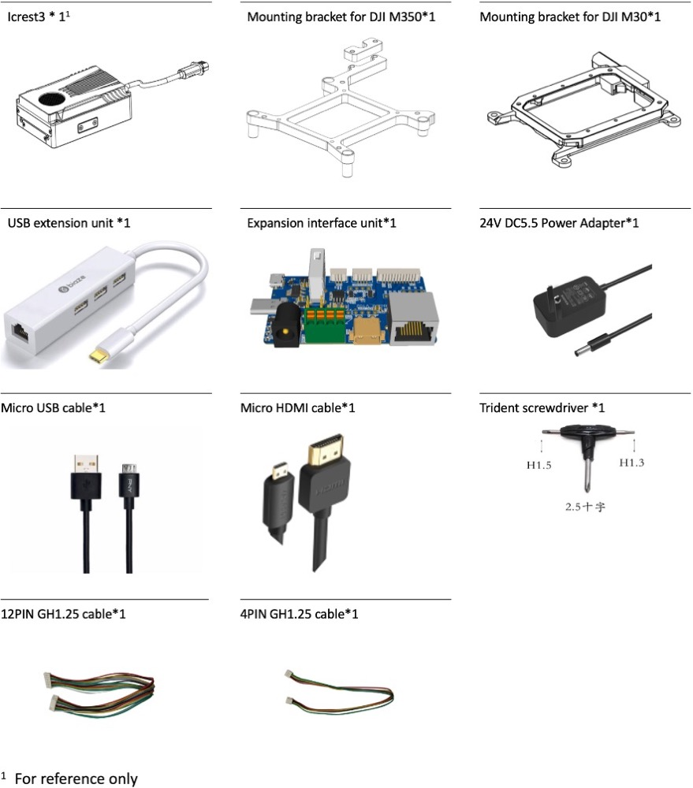

# 产品概览

## Icrest3是什么？

---

Icrest3是专为 无人机开发者打造的第三代微型计算机，搭载 NVIDIA Jetson Xavier NX 模块，
可更加快速地完成复杂的图形处理工作，同时具备 5G 远程网联、1.4GHz MESH去中心化组网、WIFI6网络连接功能。内置IcrestSDK，可以实现开源QGC地面站控制大疆行业无人机和AI模型快速部署。 Icrest3系列提供多种接口以连接不同的外部设备，适配大疆M3行业版、M30系列、经纬M300RTK和PX4等开源飞控系统等设备，
拥有更强的灵活性与扩展性，同时为用户提供丰富便捷的开发途径。

## 物品清单

## 预装软件

------

Icrest3预装了以下软件，用户可根据使用需求安装其他软件。

| Ubuntu 20.04 | CUDA 10.2.89  |
| :----------: | :-----------: |
| Jetpack 4.5  | OpenCV 4.5.1  |
| cmake 3.10.2 |  git 2.17.1   |
|  gcc 7.5.0   | python 2.7.17 |

## 规格参数

---

|          型号          |             **Icrest3-Lite**             |            **Icrest3-NX-5G**             |           **Icrest3-Nano-5G**           |
| :--------------------: | :--------------------------------------: | :--------------------------------------: | :-------------------------------------: |
|          重量          |                   149g                   |                   236g                   |                  226g                   |
| 尺寸（不含无人机支架） |                 88x59x27                 |         88x59x35.9（不含5G天线）         |        88x59x35.9（不含5G天线）         |
|         处理器         |         NVIDIA Jetson Xavier NX          |         NVIDIA Jetson Xavier NX          |        NVIDIA Jetson Xavier Nano        |
|         AI性能         |                 21 TOPS                  |                 21 TOPS                  |               472 GFLOPS                |
|          内存          | 8GB 128-bit LPDDR4x @ 1600MHz \|51.2GB/s | 8GB 128-bit LPDDR4x @ 1600MHz \|51.2GB/s | 4 GB 64 bit LPDDR4 @1600 MHz \|25.6GB/s |
|        板载存储        |                128GB SSD                 |                128GB SSD                 |                128GB SSD                |
|      TF卡扩展存储      |                    √                     |                    √                     |                    √                    |
|          网络          |     ● 千兆以太网GH1.25接口  ● WIFI6      | ● 5G NR ● 千兆以太网GH1.25接口  ● WIFI6  | ● 5G NR● 千兆以太网GH1.25接口  ● WIFI6  |
|         SIM卡          |                    /                     |               Nano SIM x 2               |              Nano SIM x 2               |
|          USB           |      USB 3.1 (10Gbps) + USB 2.0 x 3      |      USB 3.1 (10Gbps) + USB 2.0 x 3      |     USB 3.1 (10Gbps) + USB 2.0 x 3      |
|        显示接口        |                Micro HDMI                |                Micro HDMI                |               Micro HDMI                |
|          I/O           |        UART 接口 × 2、CAN接口 x 1        |        UART 接口 × 2、CAN接口 x 1        |       UART 接口 × 2、CAN接口 x 1        |
|          功率          |                  5-25 W                  |                  5-25 W                  |                 5-10 W                  |
|        电源输入        |          12 - 56 V 电源接口 ×1           |          12 - 56 V 电源接口 ×1           |          12 - 56 V 电源接口 ×1          |
|        电源输出        |                  12V/3A                  |                  12V/3A                  |                 12V/3A                  |
|        工作温度        |                -25 至 50℃                |                -25 至 50℃                |               -25 至 50℃                |
|        防护等级        |                   IP45                   |                   IP45                   |                  IP45                   |

