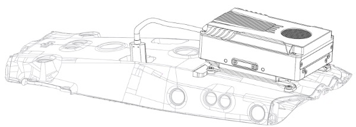
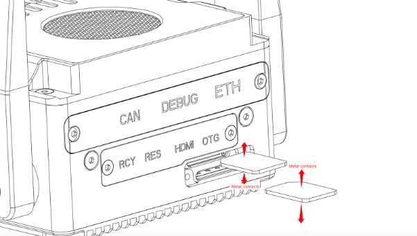

# 设备安装与连接

## **大疆无人机安装**

### M300RTK/M350RTK使用装配

### M30系列使用装配

### M3系列使用装配
待补充...

## **SIM卡安装**

## 

## **开发调试接口连接**
Icrest3可以提供3种方式进行开发调试，用户可根据实际需求进行硬件连接
1. DEBUG UART有线连接
2. OTG 有线连接（仅M300RTK）
3. WIFI连接
4. 以太网有线连接

### 使用大疆无人机M350RTK/M300RTK/M30/M3T调试

### 桌面单机调试

> 此时供电使用外部电源适配器供电，不需要使用无人机进行供电。

### 接入1.4GHz等第三方私有图传链路调试

### 使用QGC地面站控制调试拓扑图

