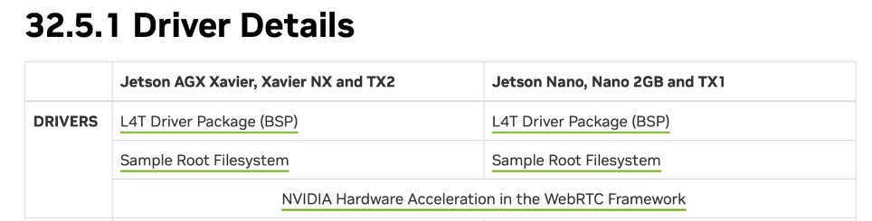
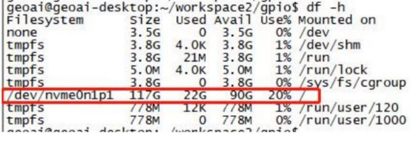
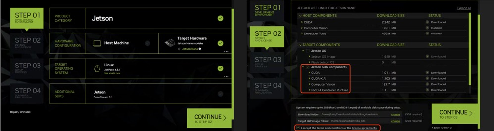
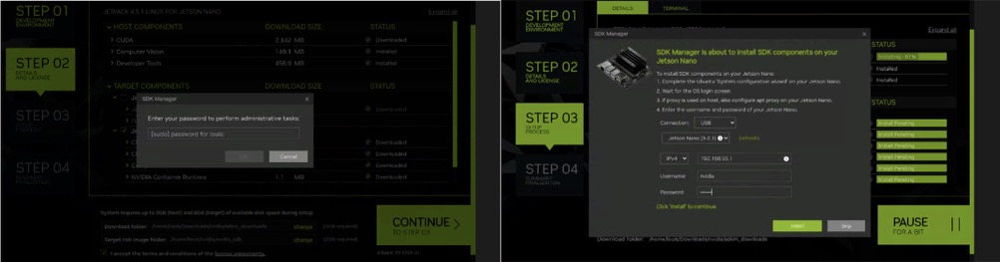

# 系统镜像

Icrest3 支持恢复模式、还原及镜像备份。连接Icrest3至主机（HOST PC）并进入恢复模式，可进行系统还原及镜像备份。

## 准备工作

------

1. 准备一台Ubuntu 系统的计算机作为主机，并确保硬盘空间大于128GB。
2. 访问以下网址获取最新Geoai 官方镜像文件,此文件包含Geoai 官方镜像以及进行镜像备份和系统还原所需的工具。 

   http://gofile.me/79fsr/6LMONhwxT

   > 推荐使用geoai镜像，geoai镜像包含整个硬件模块的驱动。

## 进入恢复模式

------

1. 连接Icrest3 的OTG接口（MicroUSB）至主机。
2. 将RCV按键按下不松开，连接Icest3 电源，保持RCV按下3秒后释放。

> ⚠️请勿使用尖锐的卡针戳此按键，否则容易损坏；建议使用附赠螺丝刀内六角头进行按键操作。

3. 在Ubuntu主机的终端界面中输入`$ lsusb`，若显示有Nvidia Corp设备，则成功进入恢复模式。若未显示Nvidia Corp设备，则检查连线及进入方式是否正确，然后重试。

## 系统还原

> Icrest3系统启动过程：Icrest3上电--> eMMC引导 --> SSD启动

### 使用geoai官方镜或用户镜像

1. 进入恢复模式
2. 烧写eMMC,下载[nvidia官方镜像](https://developer.nvidia.com/embedded/linux-tegra-r3251)压缩包，并将如下下载的压缩包文件复制到Ubuntu系统HOST PC

tegra186_linux_r32.5.1_aarch64.tbz2

tegra_linux_sample-root-filesystem_r32.5.1_aarch64.tbz2



> 以上压缩包为Ubuntu18.04系统，如需其他版本，请按需下载。

3.  输入以下命令解压压缩包

```shell
tar -jxvf tegra186_linux_r32.5.1_aarch64.tbz2
sudo tar -jxvf tegra_linux_sample-root-filesystem_r32.5.1_aarch64.tbz2 -C Linux_for_Tegra/rootfs
cd Linux_for_Tegra 
sudo ./apply_binaries.sh
```

4. 输入以下命令行进行系统烧写

```SHELL
cd Linux_for_Tegra

sudo ./flash.sh jetson-xavier-nx-devkit-emmc mmcblk0p1
```

5. 等待eMMC烧写完成


6. 连接HDMI显示器和鼠标键盘，为Icrest3配置用户名和密码 为nvidia, nvidia

7. 烧写SSD，系统将由eMMC引导至SSD启动                              

   云冠上电，通过OTG cable登入系统，通过以下链接将下载好的fdisk.sh、rootOnNVMe和rootOnEMMC 文件夹上传至home/nvidia目录下

   http://gofile.me/79fsr/6LMONhwxT 

8. 通过以下指令，将nvme0n1p1 挂载到/mnt 目录下

```SHELL
sudo mkfs.ext4 /dev/nvme0n1p1  #格式化SSD
sudo ./fdisk.sh  #分区处理
sudo mount /dev/nvme0n1p1 /mnt/  #挂载到/mnt 目录下
sudo chmod 777 /mnt -R  #给/mnt目录权限 
```

9. 通过以下链接下载geoai SSD系统压缩包rootfs.tar.gz上传至云冠3的/mnt目录下

   http://gofile.me/79fsr/6LMONhwxT

   > 请使用FileZilla进行文件传输

10. 登入云冠3系统，通过以下指令解压rootfs.tar.gz并将系统启动切换至 SSD 

```shell
cd /mnt  #进入/mnt目录
sudo tar -xvf rootfs.tar.gz  #解压压缩包
sudo rm rootfts.tar.gz
cd ~/home/nvidia/rootOnNVMe
sudo chmod 777 setup-service.sh #给/setup-service.sh 权限 
sudo ./setup-service.sh #将 root 设置为 SSD
sudo reboot #重启系统
```

11. 执行 `df -h` 命令,看到/dev/nvme0n1p1 则表示成功



### 使用Nvidia官方镜像

1. 进入恢复模式

2. 烧写eMMC

   > 参考“使用geoai官方镜或用户镜像” 1~6步骤。

3. 将eMMC复制至SSD

   使用FileZilla将fdisk.sh rootOnNVMe两个文件上传至Icrest3/home/nvidia目录下

   > fdisk.sh rootOnNVMe下载链接
   >
   > http://gofile.me/79fsr/6LMONhwxT 

​	在终端输入以下指令对SSD进行分区和文件复制

```shell
sudo chmod 777 fdisk.sh  #给权限
 suod ./fdisk.sh  #分区处理
 cd rootOnNVMe  #进入目录下
 sudo chmod 777 copy-rootfs-ssd.sh  #给权限
 ./copy-rootfs-ssd.sh     #复制到SSD
 ./setup-service.sh      #设为SSD启动
 sudo reboot      #重启系统
```

​	输入`df -h` 查看系统是否挂载在SSD上，显示/dev/nvmen1p1，说明系统挂载至SSD成功


4. 下载并安装SDK Mananger至Ubuntu 系统主机

   可以从 [https://developer.nvidia.com/sdk-manager](https://link.zhihu.com/?target=https%3A//developer.nvidia.com/sdk-manager) 下载SDK Manager安装包（如下图），这里推荐下载第一种“.deb”会比较简单，下面的“SDK Mananger User Guide”链接是这个软件的使用手册。

   

5. 下载好安装包之后，在Ubuntu系统里执行以下指令：

   ```shell
   $	sudo apt install ./sdkmanager_[version]-[build#]_amd64.deb
   ```

例如:

```shell
$	sudo apt install ./sdkmanager_1.9.2-10889_amd64.deb
```

6.  安装好之后直接在命令终端执行“sdkmanager”就会启动以下的启动画面：

   

> NVIDIA要求使用者必须先拥有开发者账户，如果还没有的话就需要先申请一个。

7. 安装cuda等软件包

   > Ubuntu系统和Icrest3需要连接至互联网，否则安装过程中会报错





等待安装完成


8. 进入终端安装jtop

   ```SHELL
   sudo vim /etc/apt/sources.list.d/nvidia-l4t-apt-source.list  #注释掉内部的那两行
   sudo apt update
   sudo apt upgrade
   sudo apt-get install build-essential cmake git unzip pkg-config libjpeg-dev libpng-dev libtiff-dev libavcodec-dev libavformat-dev libswscale-dev libgtk2.0-dev libcanberra-gtk* python3-dev python3-numpy python3-pip libxvidcore-dev libx264-dev libgtk-3-dev libtbb2 libtbb-dev libdc1394-22-dev gstreamer1.0-tools libv4l-dev v4l-utils libgstreamer1.0-dev libgstreamer-plugins-base1.0-dev libavresample-dev libvorbis-dev libxine2-dev libfaac-dev libmp3lame-dev libtheora-dev libopencore-amrnb-dev libopencore-amrwb-dev libopenblas-dev libatlas-base-dev libblas-dev liblapack-dev libeigen3-dev gfortran libhdf5-dev protobuf-compiler libprotobuf-dev libgoogle-glog-dev libgflags-dev
   sudo apt-get install libhdf5-serial-dev hdf5-tools
   sudo apt-get install libatlas-base-dev gfortran
   sudo -H pip3 install -U jetson-stats
   sudo reboot 
   ```

## 镜像备份（TBD）

用户可自行制作镜像备份用于系统还原。若使用Geoai 官方镜像进行还原，则无需进行镜像备份。镜像备份仅备份SSD中的内容，eMMC 中的数据将不会备份。

1. 确保Windows主机可用硬盘空间大于128GB 以存放镜像文件。

2. 在Windows主机的cmd终端界面，进入SSD镜像文件所在目录，然后输入以下命令。 

   ```SHELL
   ~$ cd workspace2/icreast_tools/
   sudo ./img_backup 192.168.1.255 -a
   ```


> 务必使用sudo 超级权限进行解压，否则将导致镜像备份失败。

3. 等待备份完成

   

4. 备份完成后，在/mnt目录可以看到备份的镜像文件