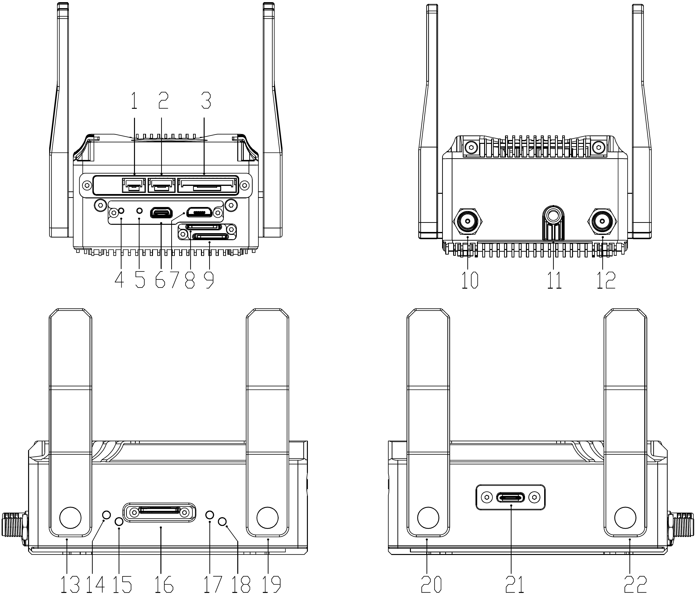

# 部件名称

## Icrest3

1. CAN口
   引脚线序：

   |  左  |       | 右  |
   | :--: | :---: | :---: |
   |  1   |   2   |   3   |
   | GND  | CAN_L | CAN_H |

   > 板端连接器规格：GH1.25 3P

2. DEBUG UART串口

   引脚线序：

   |  左  |          |          |           右            |
   | :--: | :------: | :------: | :---------------------: |
   | GND  | UART_RX  | UART_TX  |        UART_VCC         |
   |      | 默认3.3V | 默认3.3V | 1.8V~5V（默认可以不接） |

   > DEBUG UART 接口波特率为115200。
   >
   > 板端连接器规格：GH1.25 4P

3. 千兆以太网口、12V对外供电口

   |    左    |          |          |          |          |          |          |          |      |      |         |   右    |
   | :------: | :------: | :------: | :------: | :------: | :------: | :------: | :------: | :--: | :--: | :-----: | :-----: |
   |    1     |    2     |    3     |    4     |    5     |    6     |    7     |    8     |  9   |  10  |   11    |   12    |
   | LAN_D1_P | LAN_D1_N | LAN_D2_P | LAN_D2_N | LAN_D3_P | LAN_D3_P | LAN_D4_P | LAN_D4_N | GND  | GND  | 12V_OUT | 12V_OUT |

   > 千兆：1~8
   >
   > 百兆：1~4
   >
   > 12V 对外供电最大电流为3A。
   >
   > 板端连接器规格：GH1.25 12P

4. Recovery按键

   恢复按键，按下恢复按键不要松开，再上电云冠3，可进入恢复模式。详见“系统镜像”。

5. Reset按键

   重启按键，短按一次可重启云冠3。

6. HDMI输出接口 

   连接至显示屏。

7. OTG2.0（MicroUSB）

8. SIM1

9. SIM2

10. 1.4GHz射频SMA接头ANT1

11. 大疆PSDK口

12. 1.4GHz射频SMA接头ANT2

13. 5G通信天线

14. LED1

15. LED2

16. TF卡接口

17. LED3

18. LED4

19. 5G通信天线

20. 5G通信天线

21. USB3.1

22. 5G通信天线

## 扩展模块

- GH1.25连接座转RJ45、USB模块

## 电源适配器

用作Icrest3供电使用，只能接入Icrest3的OSDK/PSDK口。供电能力为48W（24V/2A）。

> ⚠️该电源适配器输出电压为24V，请勿用在其他设备，否则有损坏风险。
